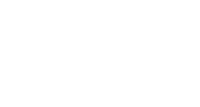

<div align="center">

 

```text
 ███   █    █████  █████  █   █  █████  █████   ███ 
█   █  █    █        █    █   █  █        █    █   █
█████  █    ████     █    █████  ████     █    █████
█   █  █    █        █    █   █  █        █    █   █
█   █  ███  █████    █    █   █  █████  █████  █   █
```

 
</div>


# ALETHEIA · EU Political Intelligence

> *"Truth, unconcealed."* — from the Greek ἀλήθεια

**EU votes, money, and influence — in plain language.**

ALETHEIA is an AI-powered political transparency platform for the European Union. Ask any question in natural language; the system classifies your intent, pulls structured data across three intelligence modules, and streams a cited analysis — surfacing who voted how, who spent what lobbying them, and how the media framed it.

---

## The Problem

EU legislative processes generate enormous amounts of public data — roll-call votes, transparency register filings, committee records — but it is scattered, technical, and practically inaccessible to most citizens and journalists. Lobbying influence is declared but never contextualised. Conflicts of interest exist in the open, but require hours of cross-referencing to surface.

**ALETHEIA collapses that gap.**

---

## Demo

```
"Who lobbied against the Nature Restoration Law?"
"How did MEPs vote on the AI Act?"
"Is there a conflict of interest around von der Leyen and pharma?"
"Tell me about MEP Axel Voss"
"Show me everything on farm subsidies"
```

The AI classifies each query, activates only the relevant intelligence modules, and streams a plain-language analysis with inline citations. The dashboard surfaces underlying data simultaneously — with full restoration of any previous query from the conversation history.

---

## Intelligence Modules

The dashboard always shows all three modules. Data loads only when contextually relevant — a policy query activates everything; a profile query focuses on voting and news, with lobbying gated behind a specific legislative context.

### Voting & Parliament
Roll-call records, party breakdowns, and MEP positions — visualised as an interactive EU Parliament hemicycle.

- Full party breakdown table with vote distribution
- Key MEP positions with roles and notable positions
- Drill-down: party → individual MEP profiles
- MEP profile: biography, committees, past votes, lobby connection network graph (radial SVG — meeting counts, declared spend, sector)

### Lobbying & Money
Declared spend from the EU Transparency Register (17,081 registered organisations), ranked by organisation.

- Top actors by declared spend with sector and people involved
- Heuristic conflict signals: commercial actor + policy overlap, high spend band, multiple aligned registrants
- Period and financial year attribution
- Direct link to EU Transparency Register

### News & Sentiment
Real-time media sentiment via GDELT API across 30 days.

- Sentiment trend chart (AreaChart) with per-day scoring
- Headlines filtered by political lean (LEFT · CENTRE · RIGHT)
- Framing divergence: how left, centre, and right-leaning outlets covered the same topic
- Polarisation Index: absolute gap between average left and right outlet sentiment

---

## AI Agent Architecture

```
User query
    │
    ▼
┌─────────────────────────────────────────────┐
│  /api/classify  (claude-haiku-4-5)          │
│  Fast JSON routing — modules, entities,     │
│  timeframe, query_type, moduleContext       │
└─────────────┬───────────────────────────────┘
              │  ClassificationResult
              ▼
┌─────────────────────────────────────────────┐
│  /api/summarize  (claude-sonnet-4-6)        │
│  Tool-use agentic loop — max 3 rounds       │
│                                             │
│  Tools:                                     │
│  ├── fetch_voting_data  → EP Open Data API  │
│  ├── fetch_news_data    → GDELT API         │
│  └── get_entity_background → Wikipedia     │
│                                             │
│  + EU Transparency Register search         │
│    (17k orgs, keyword-scored, cached)      │
└─────────────┬───────────────────────────────┘
              │  ModuleData + streamed text
              ▼
┌─────────────────────────────────────────────┐
│  mergeModuleData()                          │
│  Overlays live tool results onto scenario  │
│  fixtures — hybrid provenance per slice    │
└─────────────┬───────────────────────────────┘
              │
              ▼
         Dashboard + streamed summary
```

**Classification** (`claude-haiku-4-5`) — routes each query to the relevant modules. Policy queries activate all three. Person queries (no specific bill) activate Voting + News only, with a contextual hint in the Lobbying panel explaining the scope limitation. Fast, cheap, structured JSON output.

**Summarisation** (`claude-sonnet-4-6`) — tool-use loop fetches real data then streams a 3–4 sentence analysis. Writes like The Economist: names names, cites figures, flags conflicts of interest without hedging. Inline `[n]` citation markers reference specific data points.

**Fallback** — with no API key, the system still fetches real EP Open Data and GDELT results, merges them with fixture data, and generates a templated summary. Every layer degrades gracefully.

---

## Conversation Intelligence

ALETHEIA tracks every query in a persistent conversation history:

- **CHAT tab** — active summary + prior queries in reverse order
- **HISTORY tab** — full timeline grouped by date (Today / Yesterday / date)
- **One-click restore** — click any past query to restore the complete dashboard state without a new API call
- **localStorage persistence** — history survives page refreshes (capped at 50 entries)

---

## Interface

**Landing page** — Marketing page with Three.js animated blob, stats (705 MEPs, €1.9B+ declared spend, 27 member states), feature overview, and a hero search bar.

**Cream input** — Minimal Claude-style query box. Wordmark, tagline, single input.

**Dashboard** — Three-panel bento grid. Voting spans the full left column; Lobbying and News split the right. Each panel has a live status dot and an expand button. Inactive modules (from context-aware routing) show a targeted empty state explaining what query would activate them.

**Expanded views** — Clicking expand fills the entire dashboard with the full interactive version of that module. No modal overlay — replaces the bento grid in-place with a slide transition. Collapse returns to the grid.

---

## Design System

Warm, typographic, deliberately calm. EU politics is already loud enough.

### Ethos

The interface takes no position. Cream surfaces and ink-opacity hierarchies keep the visual temperature low so the data speaks. The accent — rose — marks conflict, opposition, and citations: wherever ALETHEIA surfaces tension, the colour signals it without editorialising. Every element earns its place; nothing decorates without informing.

### Colour

| Token | Hex | Role |
|---|---|---|
| **Cream** | `#F0EDE8` | All surfaces — background, cards, inputs |
| **Ink** | `#1A1A18` | Primary text and all foreground elements |
| **Rose** | `#C9A89A` | Conflict signals · opposition votes · citations |
| **Sand** | `#D4C4A8` | Loading skeletons · secondary accent |
| **Warmgrey** | `#8A8882` | News module · secondary text · CENTRE lean |
| **Charcoal** | `#4A4A48` | Tertiary labels · status text |

Opacity on Ink creates the full tonal scale — from `1.0` (primary text) down to `0.05` (hairline backgrounds) — without introducing extra hues.

| Opacity | Value | Use |
|---|---|---|
| 82% | `rgba(26,26,24,0.82)` | FOR votes |
| 65% | `rgba(26,26,24,0.65)` | Body text · LEFT lean |
| 45% | `rgba(26,26,24,0.45)` | Secondary labels |
| 25% | `rgba(26,26,24,0.25)` | Borders |
| 12% | `rgba(26,26,24,0.12)` | Card borders |
| 08% | `rgba(26,26,24,0.08)` | Dividers · skeleton track |

### Module colour language

| Module | Indicator | Semantic pair |
|---|---|---|
| Voting | `rgba(26,26,24,0.6)` | FOR dark · AGAINST rose |
| Lobbying | `#C9A89A` | Conflict rose |
| News | `#8A8882` | Positive ink · Negative rose |

### Typography

| Family | Weights | Role |
|---|---|---|
| **DM Sans** | 200 · 300 · 400 · 500 | Everything — display to caption |
| **Instrument Serif** | 400 · italic | Hero tagline only |

Display runs at weight 200 with wide letter-spacing (`0.14–0.18em`). Body runs at weight 300. Labels run at weight 500 in uppercase with `0.14–0.16em` tracking. Line-height 1.6 for body; 0.93 for the hero headline.

| Size | Weight | Use |
|---|---|---|
| `clamp(56px, 11vw, 140px)` | 400 | Hero wordmark |
| 15px | 300 | Card titles · input |
| 13px | 300 | Summary text · chat |
| 10px | 500 | Labels (uppercase) |
| 9px | 500 | Micro labels · status tags |
| 8px | 500–600 | Pill badges · section headers |

### Layout

3-column bento at `1.15fr / 0.85fr` with 1px grid gaps as dividers. Voting spans the full left; Lobbying and News split the right vertically. No border-radius anywhere — sharp corners throughout. No Tailwind — inline styles only, with CSS custom properties for global tokens.

All transitions: 0.15–0.35s ease-out. Framer Motion handles panel slides and expand/collapse. The Three.js landing blob runs at device-adaptive quality.

---

## Stack

| Layer | Technology |
|---|---|
| Framework | Next.js 15 (App Router, Turbopack) |
| Language | TypeScript (strict) |
| AI | Anthropic SDK — Haiku (classify) + Sonnet (summarise, tool-use) |
| Animation | Framer Motion |
| Charts | Recharts |
| 3D | Three.js + EffectComposer |
| Graphs | Pure SVG (hemicycle, network) |
| Styling | Inline styles + CSS custom properties |
| Data | EP Open Data API · GDELT API · Wikipedia · EU Transparency Register |

---

## Running Locally

```bash
npm install
npm run dev
```

Open [http://localhost:3000](http://localhost:3000).

**Enable the AI agent:**

```bash
# .env.local
ANTHROPIC_API_KEY=sk-ant-...
```

Without a key, the system falls back to pre-written summaries and simulated streaming. All dashboard data is partially live (EP API + GDELT) with fixture fallbacks.

**Rebuild the Transparency Register snapshot** (optional — full ODP export):

```bash
npm run data:transparency
```

---

## Data Sources

| Source | Data | Coverage |
|---|---|---|
| [EP Open Data](https://data.europarl.europa.eu) | Plenary documents, roll-call votes | Live |
| [EU Transparency Register](https://ec.europa.eu/transparencyregister) | Declared lobbying spend, 17,081 orgs | Snapshot (ODP export) |
| [GDELT Project](https://gdeltproject.org) | News headlines, sentiment, outlet lean | Live (30-day) |
| [Wikipedia](https://wikipedia.org) | Entity background | Live |
| Scenario fixtures | Nature Restoration Law, AI Act, CSRD, CAP Reform, Pharma | Curated |

---

## Project Structure

```
src/
  app/
    page.tsx                  # Landing page + dashboard shell + state
    api/
      classify/route.ts       # Haiku classification — context-aware module routing
      summarize/route.ts      # Sonnet agentic loop — tool-use + streaming
  components/
    Header.tsx
    ChatPanel.tsx             # CHAT/HISTORY tabs + summary + conversation timeline
    DashboardPanel.tsx        # Bento grid + context-aware empty states
    StatusBar.tsx             # Module indicators + provenance + timing
    cards/
      VotingCard.tsx          # Hemicycle compact card
      LobbyingCard.tsx        # Spend + conflict signals card
      NewsCard.tsx            # Sentiment trend card
    expanded/
      VotingExpanded.tsx      # Full hemicycle + party/MEP drill-down + network graph
      LobbyingExpanded.tsx    # Full org list + conflict analysis
      NewsExpanded.tsx        # Full sentiment chart + lean filter + polarisation index
  lib/
    types.ts                  # All shared TypeScript interfaces
    mockData.ts               # Scenario datasets + MEP profiles
    mockDataSelector.ts       # Query-to-dataset routing
    pipeline/
      mergeModuleData.ts      # Live tool results + fixture merge with provenance
    sources/
      parliament.ts           # EP Open Data API client
      gdelt.ts                # GDELT news API client
      wikipedia.ts            # Wikipedia entity lookup
    transparencyRegister/
      search.ts               # Keyword-scored register search
      loadRegister.ts         # JSON snapshot loader + in-memory cache
      keywords.ts             # Search term extraction
  data/
    transparency-register.json       # Full ODP snapshot (17,081 orgs)
    transparency-register-sample.json # Bundled fallback sample
```

---

## Contributors

Built at **AgoraHacks 2026** in 48 hours.

| Contributor | Background | Links |
|---|---|---|
| **Yi-Chen Hsu** · [@gunjyo0817](https://github.com/gunjyo0817) | Computer Science @ NTHU · exchange at TUM | [LinkedIn](https://www.linkedin.com/in/yichenhsu/) |
| **Miloš Preradović** · [@prmilos](https://github.com/prmilos) | Economics and Engineering @ TU Vienna | [LinkedIn](https://www.linkedin.com/in/milo%C5%A1-preradovi%C4%87-9a0329387/) |
| **Lorenz Huber** · [@LCS3002](https://github.com/LCS3002) | Architecture @ UCL · London | [LinkedIn](https://www.linkedin.com/in/huberlorenz) |

---

## Why ALETHEIA

EU institutions publish more raw data than almost any other political body in the world. But raw data is not accountability. ALETHEIA is a demonstration that with modern AI tooling, the gap between *data exists* and *citizens can use it* can be closed in a weekend.

The name comes from the Greek ἀλήθεια — truth as unconcealment, the idea that knowledge is not created but revealed by removing what obscures it. That is exactly what we are doing: the votes, the spend, the coverage were always there. We just removed the friction.

---

*Built for AgoraHacks · April 2026 · Truth, unconcealed.*
